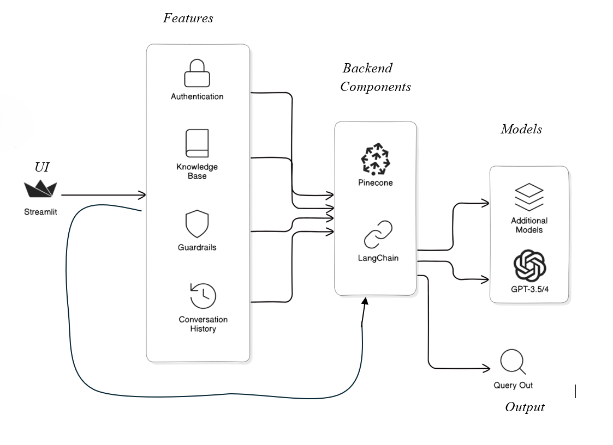

# 💰 FINANCIAL CHATBOT #
## 📖 Overview ##


This project is a chatbot created using Streamlit that helps users to understand the financial performance of **Dell**, **Pega**, and **BlackBerry**. It uses powerful AI like GPT-3.5, 4o and Groq to answer questions about these companies based on their annual reports. The application stores and retrieves information efficiently using **Pinecone** and **MongoDB**, allowing users to easily switch between AI models, clear their chat history, and keep track of their past conversations. This makes for a user-friendly and informative experience.

## 🏗️ Architecture ##




## 🛠️ Installation ##


Follow these steps to set up and run the project:

#### Step 1: ####

Clone the repository

#### Step 2: ####

Set up a virtual environment with python version 3.12 using your preferred tool (e.g., virtualenv or conda).

#### Step 3: ####

Install the required libraries and dependencies by running one of the following commands:
 
Using pip:
 
```
pip install -r requirements.txt
```
 
Using conda:
```
conda install -r requirements.txt
```
#### Step 4: ####

set up your environment variables:

- Get your MongoDB connection URI (MONGO_URI) by signing up on MongoDB Atlas or setting up a local MongoDB server.
- Sign up on Pinecone to get your API key (PINECONE_API_KEY). You'll also need to upload your documents to Pinecone for vector storage.
- Create an account on Groq and generate your API key (GROQ_API_KEY) for integration.
- Sign up or log in to OpenAI to get your API key (OPENAI_API_KEY) for accessing GPT models.

#### Step 5: ####

Start the Financial chatbot application with the following command:

``` streamlit run app.py ```

## ⚙️ Tools & Technologies ##

- 🔗 LangChain: Used for creating advanced pipelines for LLM applications.
- 🛢️ MongoDB (Atlas Cloud): Serves as the database for storing user details and chat history efficiently.
- 🌲 Pinecone: High-performance vector database for managing embeddings and supporting semantic search.
- ⚛️ Streamlit: Framework used to build interactive and user-friendly frontend interfaces.
- 🤖 AI Tools: Open AI and Groq
